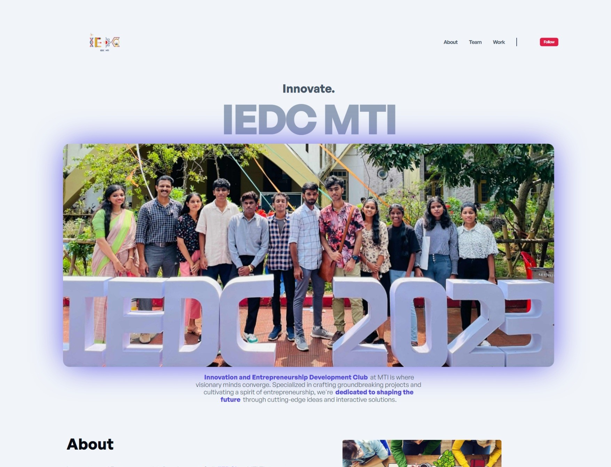

# IEDC Club Website

## Project Overview

* This website was built for the IEDC Club at MTI Thrissur, Kerala using Vite.js.
* It aims to provide a platform for club members to stay informed, connect with each other, and learn about technology.

## Key Features

* **Modern and responsive design:** Built with Vite.js and Vanilla CSS for a fast and aesthetically pleasing user experience.
* **Component-based architecture:** Individual components styled separately for maintainability and easier development.
* **Variable and root usage in CSS:** Efficient styling with variables and root elements for consistent brand identity.
* **Easy content management:** Simple system for updating website content without touching code.

## Development Stack

* Frontend: Vite.js, Vanilla HTML JS CSS
* Build Tool: Vite
* Testing: Jest

## Challenges and Solutions

* Aligning the logo was the most significant challenge, requiring additional CSS tweaks.
* Other styling aspects were manageable thanks to component-based development.

## Future Plans

* Continue adding features based on user feedback and club needs.
* Implementing js frameworks.
* Improve accessibility for a wider audience.

## Deployment

The website is currently deployed on Vercel at https://iedcmti.vercel.app/.